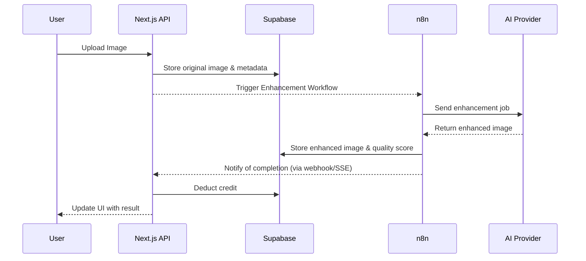
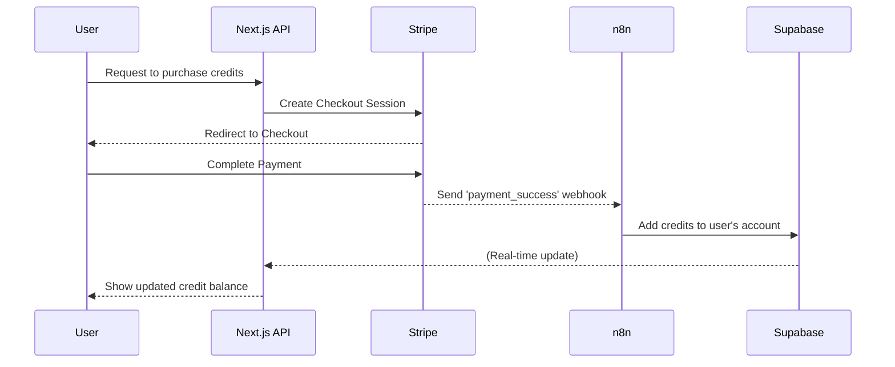

# AI Food Photo Enhancer Fullstack Architecture Document

## 1\. Introduction

This document outlines the complete fullstack architecture for the AI Food Photo Enhancer, including backend systems, frontend implementation, and their integration. It serves as the single source of truth for AI-driven development, ensuring consistency across the entire technology stack.

### Starter Template or Existing Project

**Confirmed:** This is a greenfield application. No starter template will be used, as a custom build is required to support the specialized AI workflow orchestration and billing logic established in the PRD.

### Change Log

| Date        | Version | Description           | Author           |
| :---------- | :------ | :-------------------- | :--------------- |
| 30-Jul-2025 | 1.1     | Final compiled version| Winston (Architect) |

## 2\. High Level Architecture

### Technical Summary

The AI Food Photo Enhancer is a full-stack, serverless-first application built on a modern Jamstack architecture. The system features a unified Next.js application for both the user-facing frontend and the API layer, hosted on Vercel. Backend services, including the PostgreSQL database, user authentication, and file storage, will be provided by Supabase. A key component is a decoupled n8n workflow engine responsible for orchestrating the multi-provider AI image processing pipeline.

### Platform and Infrastructure Choice

  * **Platform:** Vercel for frontend hosting and serverless functions; Supabase for backend-as-a-service (BaaS).
  * **Key Services:** Next.js Serverless Functions, Supabase PostgreSQL, Supabase Auth, Supabase Storage with CDN, and a managed n8n instance for workflow automation.

### Repository Structure

  * **Structure:** Monorepo. This approach is ideal for managing the unified Next.js application and allows for easily sharing code and types.
  * **Monorepo Tool:** Managed with pnpm workspaces and optimized with Turborepo for efficient builds.

### High Level Architecture Diagram

```mermaid
graph TD
    subgraph "User Facing (Vercel)"
        A[Next.js App <br> (Frontend & API Layer)]
    end

    subgraph "Backend Services (Supabase)"
        B[Supabase DB <br> (PostgreSQL)]
        C[Supabase Storage <br> (CDN)]
        D[Supabase Auth]
    end

    subgraph "Orchestration & AI (n8n & APIs)"
        E[n8n Workflow Engine]
        F[AI Providers <br> (OpenAI / fal.ai)]
        G[External APIs <br> (Stripe)]
    end

    A -- Manages User Data --> B
    A -- Manages Files --> C
    A -- Authenticates Users --> D
    A -- Triggers Workflows --> E
    E -- Sends Jobs to --> F
    E -- Manages Payments via --> G
```

### Architectural Patterns

  * **Serverless Architecture:** The stack is built on managed, serverless services, optimizing for scalability, cost-effectiveness, and reduced operational overhead.
  * **Backend as a Service (BaaS):** Supabase is heavily leveraged to handle common backend complexities like database, authentication, and file storage.
  * **Workflow Orchestration:** The AI processing pipeline is decoupled from the main application and managed by n8n. This makes the system more resilient and modular.
  * **Component-Based UI:** The frontend will be built with React (via Next.js) and the HeroUI component library.

## 3\. Tech Stack

### Versioning Strategy

  * **Production:** All dependencies are pinned to the exact versions specified below in `package.json` to ensure deterministic and stable builds.
  * **Updates:** Dependency updates will be reviewed quarterly, with immediate updates applied for critical security patches.

| Category             | Technology         | Version       | Purpose & Rationale                                       |
| :------------------- | :----------------- | :------------ | :-------------------------------------------------------- |
| **Core Framework** | Next.js            | 15.4          | React 19 compatibility, Turbopack, App Router stable      |
| **Core Language** | TypeScript         | 5.8.3         | ES module improvements, new type checks, smaller output   |
| **Runtime** | Node.js            | 22.17.1 LTS   | V8 12.4, built-in WebSocket, improved watch mode, permissions |
| **Frontend & UI** | HeroUI             | 2.8.2         | 200+ components, React 19 typings, Tailwind v4 integration |
| **Styling** | Tailwind CSS       | 4.1.2         | Native CSS nesting, logical props, improved JIT caching   |
| **Animation** | Motion.dev         | 12.23.11      | React 19 anims, async variants, reduced bundle size       |
| **Backend & Database** | Supabase           | 2.53.0        | Branching 2.0, Storage 10× uploads, Node 20+ target     |
| **CDN Optimization** | Cloudflare Images  | API v1        | AVIF auto-conversion, signed URL v2 for advanced image delivery |
| **Image Processing** | Sharp.js           | 0.34.3        | Animated GIF→WebP fix, PDF background support             |
| **Workflow Engine** | n8n                | 1.104.1       | Unlimited executions, enhanced AI orchestration, RAG templates |
| **AI Providers** | OpenAI API         | v2 (GPT-4o)   | Streaming Vision, JSON-mode, GPT-4o-128k                  |
| **Payments** | Stripe             | 18.3.0        | API 2025-06-30, crypto payments preview, flexible plans   |
| **Email Service** | Resend             | 4.7.0         | Batch idempotency, React Email 4 templates, webhooks helper |
| **Real-time Updates**| Server-Sent Events | Native Web API| Efficient one-way streaming for AI processing status      |
| **Security & Validation**| Zod                | 4.0.14        | v3/v4 permalinks, faster parsing, optional chaining fix   |
| **Package Manager** | pnpm               | 10.13.1       | Corepack-aware, new lockfile, faster hoisting             |
| **Testing Framework**| Vitest             | 3.2.4         | Snapshots v2, perf up, UI 2.2, Node 18+ default           |
| **Error Tracking** | Sentry             | 9.43.0        | OTEL 1.34, Vercel AI tracing, SpotLight suppression       |
| **Deployment** | Vercel             | Platform      | Node 22.x default, fast Edge KV, Private Networking       |

## 4\. Data Models

The core data models will be implemented as tables in the Supabase PostgreSQL database. The initial schema is defined as follows:

  * `users`: Stores user profiles and authentication data from Supabase Auth.
  * `teams`: Manages team workspaces, settings, and ownership (for Phase 2).
  * `team_members`: A junction table linking users to teams with specific roles.
  * `images`: Stores metadata for original and enhanced images, including file paths, user ratings, and recovery status.
  * `credits`: Manages credit transactions, balances, and subscriptions for each user.
  * `enhancement_jobs`: Tracks the status and results of each AI processing job, including quality scores and retry counts.

## 5\. API Specification

The Next.js application will expose a RESTful API surface for all client-side operations.

### API Surface

  * `POST /api/upload`: Handles image upload and initial validation.
  * `POST /api/enhance`: Initiates an enhancement request, triggering the n8n workflow.
  * `GET /api/credits`: Retrieves a user's current credit balance and transaction history.
  * `POST /api/billing/create-checkout-session`: Creates a Stripe session for purchases.
  * `POST /api/billing/webhooks`: Receives and processes webhooks from Stripe.
  * `GET /api/teams`: (Phase 2) Manages team data.

## 6\. Core Workflows

### Image Enhancement Request Flow



### Credit System Flow



## 7\. Unified Project Structure

The project will be structured as a pnpm/Turborepo monorepo to manage the application and shared packages efficiently.

```plaintext
/
├── apps/
│   └── web/                # The main Next.js application
│       ├── app/            # App Router directories
│       ├── components/     # UI components (HeroUI based)
│       ├── lib/            # Helper functions, Stripe/Supabase clients
│       └── ...
├── packages/
│   ├── ui/                 # Shared, unstyled UI components
│   ├── eslint-config/      # Shared ESLint configuration
│   └── tsconfig/           # Shared TypeScript configuration
└── package.json            # Root package configuration
```

## 8\. Deployment Architecture

  * **Vercel:** The Next.js application will be deployed to Vercel, leveraging its Git integration for continuous deployment, serverless functions for the API, and global edge network for performance.
  * **Supabase:** The Supabase project will be managed via its dashboard, with database migrations handled through its CLI.
  * **n8n:** The workflow engine will be deployed as a managed service via Elest.io on Hetzner infrastructure, configured for high availability and connected securely to the Supabase database.

## 9\. Security

  * **Authentication:** Handled by Supabase Auth, using JWTs with refresh tokens. Secure server-side clients will be used for all admin-level operations.
  * **Authorization:** Implemented via Supabase Row Level Security (RLS) to ensure users can only access their own data. Role-based permissions will be used for team features.
  * **Data Protection:** All data is encrypted at rest and in transit. Downloads use expiring signed URLs. User-facing error messages will not expose technical details.
  * **Infrastructure:** Environments will be isolated. All secrets and API keys will be managed as encrypted environment variables.